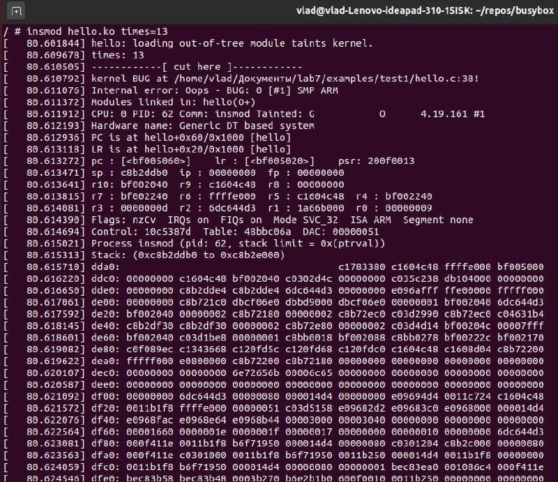
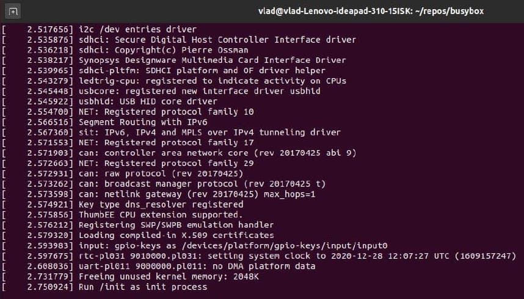
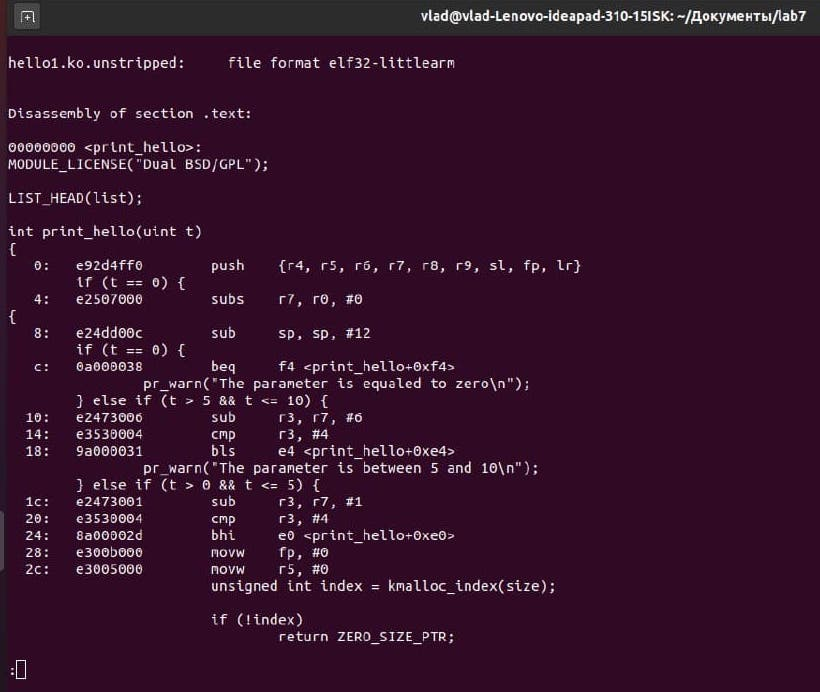
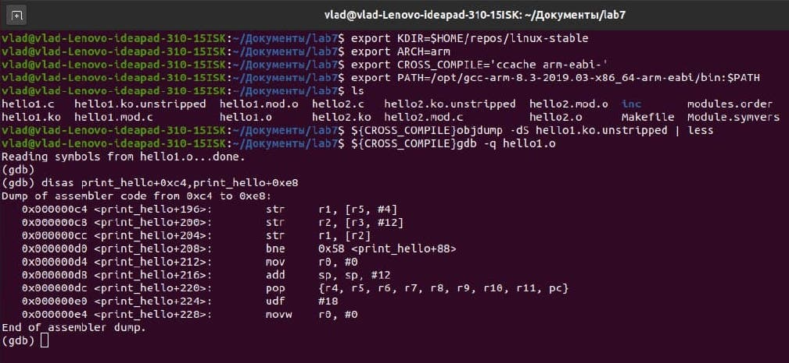

# AK2-lab7

Повідомлення про помилку
Нам потрібно рядок де позначається 0 пам'яті для елемента

Продовження дебагу

Пошук місця помилки за допомогою objdump

Пошук місця помилки за допомогою jdb

